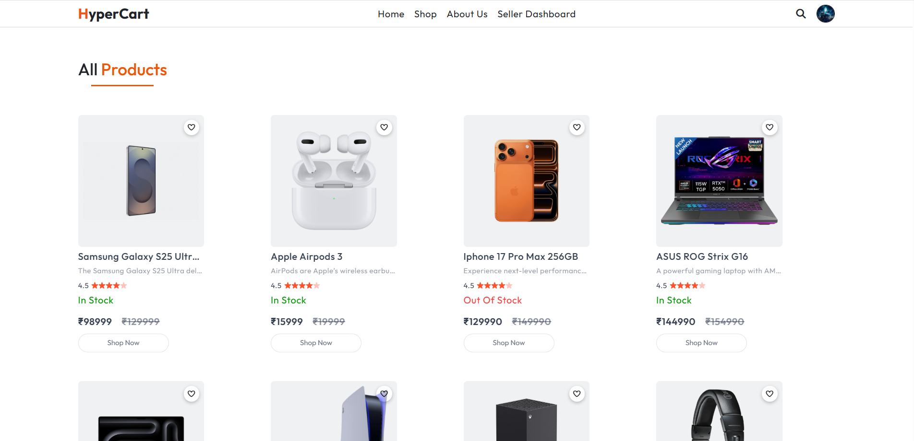
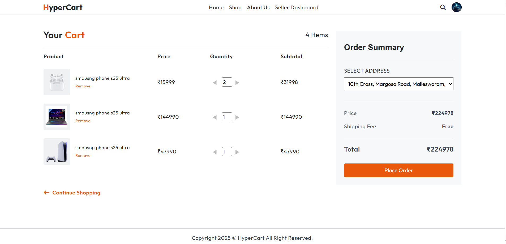
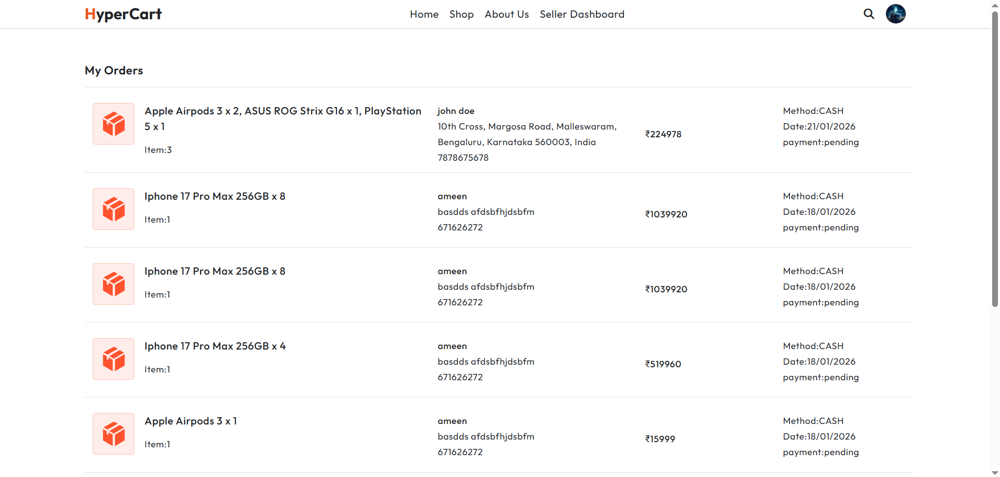
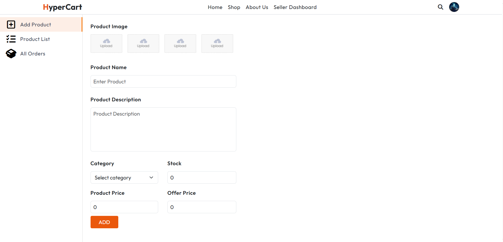
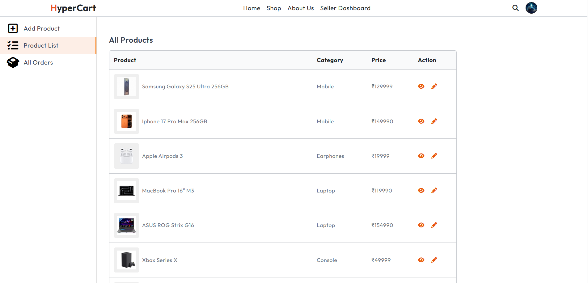
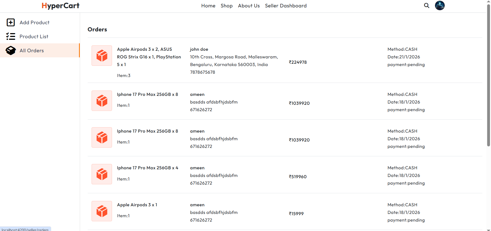

# HyperCart – Full Stack Application

HyperCart is a fast and modern full-stack e-commerce web application built to make online shopping smooth and enjoyable. It offers intuitive product browsing, smart cart handling, secure and hassle-free checkout, and a clean, responsive interface, all designed with performance, scalability, and user experience in mind.

### Home Page


### Login Page


### Product Listings



### View Product


### Cart



### Orders


### Add Product



### All Products List



### All Orders



---

## 🧱 Tech Stack

### Backend

* **Python 3.x**
* **Django**
* **Django REST Framework (DRF)**
* **JWT Authentication**
* **PostgreSQL** (Production) / SQLite (Development)

### Frontend

* **Angular** (SPA)
* **TypeScript / JavaScript**
* **REST API Integration**
* **Responsive UI**

---

## 📂 Repository Structure

```
hyper_cart/
│── backend/
│   ├── manage.py
│   ├── requirements.txt
│   ├── .env
│   ├── hyper_cart/
│   │   ├── settings.py
│   │   ├── urls.py
│   │   ├── asgi.py
│   │   └── wsgi.py
│   └── apps/
│       ├── orders/
│       ├── products/
│       └── users/
│       
│       
│
│── frontend/
│   ├── package.json
│   ├── src/
│   └── angular.json / vite.config.js
│
│── README.md
└── .gitignore
```

---
## Clone Repo

```bash
git clone https://github.com/Ameen6789/hyper_cart.git
```

## ⚙️ Backend Setup (Django)

### 1️⃣ Navigate to backend

```bash
cd backend
```

### 2️⃣ Create & activate virtual environment

```bash
python -m venv venv

# Windows
venv\Scripts\activate

# Linux / Mac
source venv/bin/activate
```

### 3️⃣ Install dependencies

```bash
pip install -r requirements.txt
```

### 4️⃣ Environment variables

Create a `.env` file in the backend directory:

```env

DB_NAME=hyper_cart
DB_USER=postgres
DB_PASSWORD=password
EMAIL_HOST_USER = youremail@gmail.com
EMAIL_HOST_PASSWORD = google app password
```

### 5️⃣ Database setup

```bash
python manage.py makemigrations
python manage.py migrate
```

### 6️⃣ Create superuser

```bash
python manage.py createsuperuser
```

### 7️⃣ Run backend server

```bash
python manage.py runserver
```

Backend runs at:

```
http://127.0.0.1:8000/
```

---

## 🎨 Frontend Setup

### 1️⃣ Navigate to frontend

```bash
cd frontend
```

### 2️⃣ Install dependencies

```bash
npm install
```

### 3️⃣ Run frontend server

```bash
npm start
# or
ng serve
```

Frontend runs at:

```
http://localhost:3000
# or
http://localhost:4200
```

---

## 🔐 Authentication Flow

* Backend provides JWT tokens
* Frontend stores token securely
* API calls include:

```http
Authorization: Bearer <access_token>
```

---

## 🔁 Development Workflow

```bash
# Backend terminal
cd backend/hypercart_backend
python manage.py runserver

# Frontend terminal
cd frontend/hypercart_frontend
ng serve
```


# To Run Using Docker

## Prerequisites

* Docker
* Docker Compose

## Environment Variables

Create a `.env` file inside:

```text
backend/hypercart_backend/.env
```

Example:

```env

DB_NAME=db-name
DB_USER=db-user
DB_PASSWORD=your-password
DB_HOST=db
DB_PORT=5432

POSTGRES_USER=postgres
POSTGRES_DB=postgres
POSTGRES_PASSWORD=your-password

EMAIL_HOST_USER=email_host
EMAIL_HOST_PASSWORD=email_host_password

DEBUG=True
PRODUCTION=True


```

## Build and Run

Build and start all services:

```bash
docker compose build
docker compose up
```

Run in detached mode:

```bash
docker compose build
docker compose up -d
```

Stop the application:

```bash
docker compose down
```

## Database Migrations


## Create Superuser

```bash
docker compose exec api python manage.py createsuperuser
```

## View Logs

All services:

```bash
docker compose logs
```

API service:

```bash
docker compose logs -f api
```

Frontend service:

```bash
docker compose logs -f web
```

Database service:

```bash
docker compose logs -f db
```

## Access the Application

Frontend:

```text
http://localhost:4200
```

Backend API:

```text
http://localhost:8000
```

Admin Panel:

```text
http://localhost:8000/admin
```

## Rebuild After Dependency Changes

Backend:

```bash
docker compose build api
```

Frontend:

```bash
docker compose build web
```

Rebuild everything:

```bash
docker compose build --no-cache
```

## Remove Containers and Volumes

```bash
docker compose down -v
```

Note: This will delete the PostgreSQL database volume and all stored data.


---


## 🔒 Security Best Practices

* Never commit `.env`
* Use HTTPS in production
* Keep secrets outside repo

---

## 📦 Deployment (Overview)

* Backend: **Gunicorn + Nginx**
* Frontend: **Build & serve static files**
* Use environment-specific configs

---


